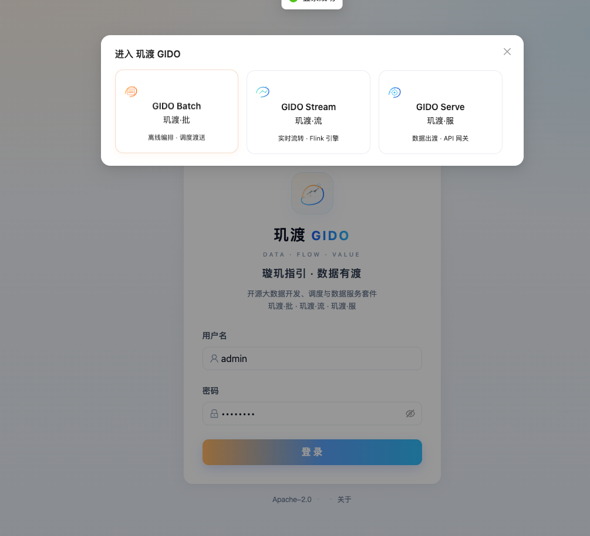
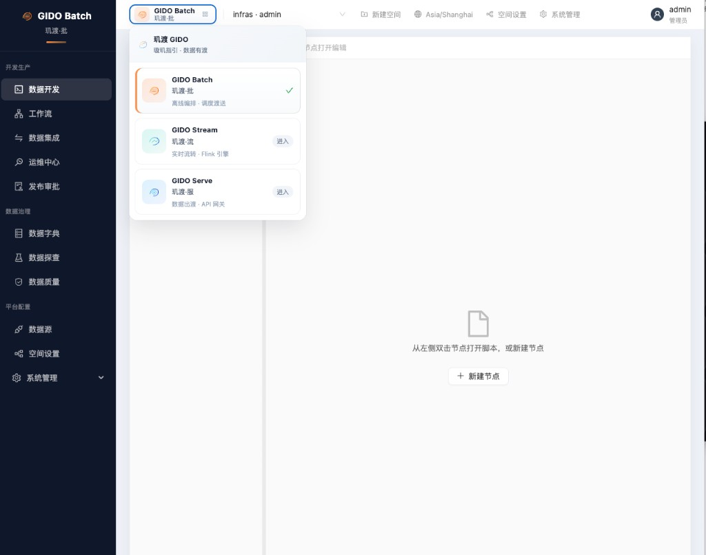
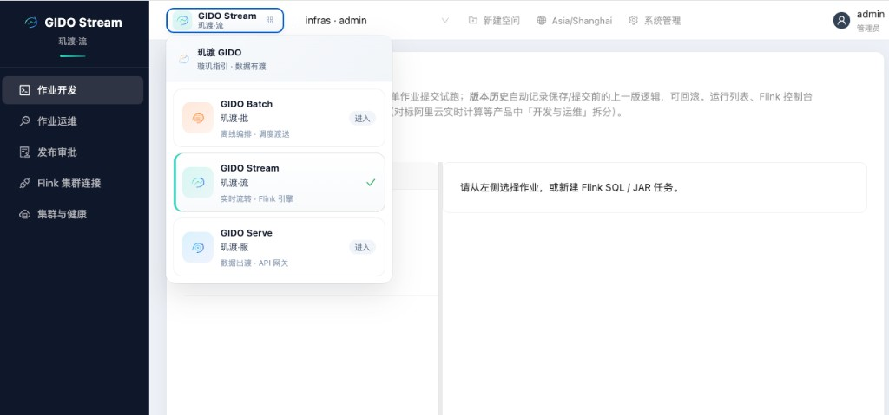
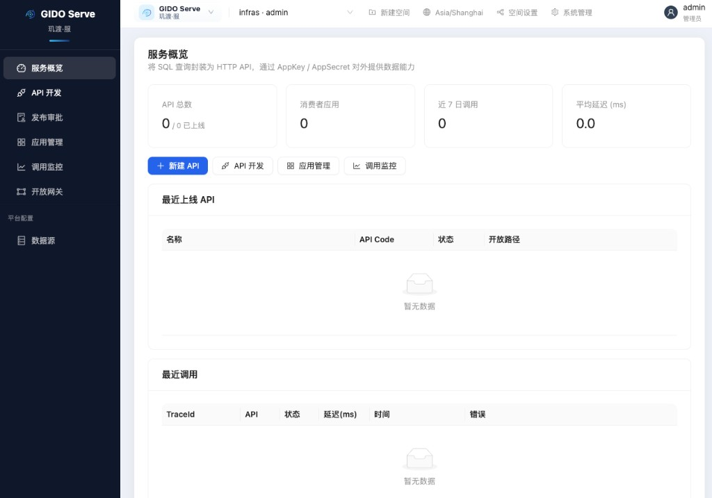

# 玑渡 GIDO · 开源大数据开发与治理平台

<p align="center">
  <strong>璇玑指引 · 数据有渡</strong><br/>
  <sub>DATA · FLOW · VALUE</sub>
</p>

<p align="center">
  <a href="LICENSE"></a>
  <a href="https://github.com/cloud-gido/gido/actions/workflows/ci.yml"></a>
  <a href="https://flink.apache.org/"></a>
  <a href="https://kafka.apache.org/"></a>
  <a href="https://gitee.com/bigdata_troy/gido"></a>
</p>


<p align="center">
  <em>开源大数据开发、调度与数据服务套件 · FastAPI + React · Docker 一键全栈</em>
</p>

<p align="center">
  <a href="#快速体验"><strong>快速体验</strong></a> ·
  <a href="#生产部署"><strong>生产部署</strong></a> ·
  <a href="docs/PRODUCT_OVERVIEW.md"><strong>产品概览（含截图）</strong></a> ·
  <a href="#三大子产品">三大子产品</a> ·
  <a href="DEPLOYMENT_GUIDE.md">文档索引</a>
</p>

---

## 三大子产品

一套账号，三个工作台 — 登录后通过顶部 **产品切换器** 进入不同模块：

| | 子产品 | 一句话 | 截图 |
|---|--------|--------|------|
| 📦 | **GIDO Batch**（玑渡·批） | 离线编排 · 调度派送 | [数据开发](docs/screenshots/03-batch-studio.png) |
| 🌊 | **GIDO Stream**（玑渡·流） | 实时流转 · Flink 引擎 | [作业开发](docs/screenshots/04-stream-studio.png) |
| 🔌 | **GIDO Serve**（玑渡·服） | 数据出渡 · API 网关 | [服务概览](docs/screenshots/05-serve-overview.png) |



### GIDO Batch · 离线开发与治理

SQL 开发、工作流 DAG、DolphinScheduler 调度、数据集成、运维中心、发布审批，以及数据字典 / 探查 / 质量治理。



### GIDO Stream · 实时流计算

Flink SQL / JAR 作业开发、运维监控、发布审批；**生产推荐 Flink Kubernetes Operator 1.15 + Flink 2.0.1**（`FlinkDeployment`）。内置 **CDC→Paimon** SQL 模板，EKS 上可对接 RDS MySQL + S3 仓库。本地全栈 Compose 仍含 Flink Session（8081）与 SQL Gateway（8083）。



### GIDO Serve · 数据服务

将 SQL 封装为 HTTP API，AppKey / AppSecret 授权，提供服务概览、调用监控与开放网关。



> 更多界面说明与菜单详解见 **[docs/PRODUCT_OVERVIEW.md](docs/PRODUCT_OVERVIEW.md)**。

---

## 生产部署

GIDO 支持 **Docker Compose 开发全栈** 与 **Kubernetes 生产** 两条路径；流作业生产默认走 **Flink Operator**，制品与 Paimon 数据可落 **S3**。

| 场景 | 入口 | 说明 |
|------|------|------|
| **AWS EKS（推荐生产）** | [docs/CDC_PAIMON_EKS.md](docs/CDC_PAIMON_EKS.md) · [k8s/eks/](k8s/eks/) | IRSA、S3 制品库、RDS CDC、Paimon warehouse |
| **K3s / OrbStack 准生产** | [k8s/README.md](k8s/README.md) · `bash k8s/deploy-gido-k3s.sh` | 分层镜像：应用每次构建，Flink 运行时按需 |
| **Kind 本机 K8s** | `bash k8s/apply-gido-stack.sh` | Operator JAR/SQL 联调 |
| **Compose 全栈** | `./start-platform.sh` | PG + Kafka + Dolphin + Flink Session |

### 生产流计算要点

```text
Stream Studio 上传 JAR/SQL
        │
        ▼
  GIDO Backend ──► S3 制品库（可选 FLINK_OPERATOR_JAR_S3_PREFIX）
        │
        ▼
  Flink Kubernetes Operator ──► FlinkDeployment（gido-flink-runtime 镜像）
        │
        ├── checkpoint → s3://…/flink-checkpoints
        └── CDC→Paimon → s3://…/paimon-warehouse
```

| 配置项 | 生产示例 |
|--------|----------|
| `FLINK_OPERATOR_JAR_S3_PREFIX` | `s3://<bucket>/gido-artifacts` |
| `PAIMON_WAREHOUSE_DEFAULT` | `s3://<bucket>/paimon-warehouse` |
| `FLINK_OPERATOR_CHECKPOINT_DIR` | `s3://<bucket>/flink-checkpoints` |
| `FLINK_OPERATOR_IMAGE` | ECR 上的 `gido-flink-runtime`（含 Paimon + CDC + S3 插件） |

EKS 完整步骤、双 IRSA（`gido-backend` 写制品 / `flink` 读仓库）见 **[docs/CDC_PAIMON_EKS.md](docs/CDC_PAIMON_EKS.md)**。功能边界与模块完整度见 **[docs/PRODUCT_MATURITY.md](docs/PRODUCT_MATURITY.md)**。

---

## 快速体验

### 前置要求

- Docker 20.10+、Docker Compose V2
- 建议 Docker Desktop 内存 ≥ 8GB

### 一键启动

```bash
git clone https://github.com/cloud-gido/gido.git
cd gido

cp .env.example .env   # 可选；生产请填写 GIDO_DS_TOKEN 等

chmod +x start-platform.sh
./start-platform.sh
```

### 登录体验

| 步骤 | 操作 |
|------|------|
| 1 | 打开 **http://127.0.0.1:3002** |
| 2 | 账号 **`admin`** / 密码 **`admin123`**（生产务必修改） |
| 3 | 选择 **玑渡·批 / 流 / 服** 进入对应工作台 |
| 4 | 账号菜单 → **关于 GIDO** 查看版本与开源信息 |

### 平台服务地址

| 服务 | URL |
|------|-----|
| GIDO 前端 | http://127.0.0.1:3002 |
| GIDO API | http://127.0.0.1:8001/docs |
| DolphinScheduler | http://127.0.0.1:12345/dolphinscheduler/ui |
| Flink Web UI | http://127.0.0.1:8081 |
| Flink SQL Gateway | http://127.0.0.1:8083 |

### 常用命令

```bash
./start-platform.sh status
./start-platform.sh logs backend
./start-platform.sh stop
bash scripts/reset-gido-docker.sh   # 端口冲突时清理
```

---

## 架构与技术栈

```
┌─────────────┐   ┌──────────────┐   ┌─────────────┐
│ GIDO Batch  │   │ GIDO Stream  │   │ GIDO Serve  │
│ 离线·治理    │   │ Flink 实时   │   │ 数据 API    │
└──────┬──────┘   └──────┬───────┘   └──────┬──────┘
       │                 │                  │
       └─────────────────┼──────────────────┘
                         ▼
              FastAPI + React + PostgreSQL
                         │
       ┌─────────────────┼─────────────────┐
       ▼                 ▼                 ▼
 DolphinScheduler   Flink Operator      Apache Kafka
   (Batch 调度)     + Paimon / CDC         (可选)
                    + S3 制品 / 仓库
```

| 层级 | 技术 |
|------|------|
| 前端 | React · Vite · Ant Design |
| 后端 | FastAPI · PostgreSQL · boto3（S3 制品） |
| 调度 | Apache DolphinScheduler（Compose 全栈 / 外置） |
| 流计算 | **Flink Operator 1.15** · Flink **2.0.1** · Paimon · MySQL CDC |
| 对象存储 | AWS S3（EKS 生产：制品 / checkpoint / Paimon warehouse） |
| 消息 | Apache Kafka（Compose 全栈） |
| 部署 | Docker Compose · Kind · K3s · **AWS EKS** |

---

## 项目结构

```
gido/                         # 仓库根
├── gido/                     # 应用代码（backend + frontend）
├── dockerFile/               # 全栈 compose（PG / Kafka / Flink Session / Dolphin）
├── docs/
│   ├── PRODUCT_OVERVIEW.md   # 产品截图与体验指南
│   ├── PRODUCT_MATURITY.md   # 功能完整度与部署边界
│   ├── CDC_PAIMON_EKS.md     # EKS 生产：CDC→Paimon + S3 制品
│   ├── FLINK_ARCHITECTURE.md # 流计算架构（Operator / 遗留 Session）
│   └── screenshots/
├── k8s/
│   ├── gido.yaml             # GIDO 最小 K8s 栈
│   ├── deploy-gido-k3s.sh    # K3s 分层一键部署
│   ├── flink-sql-runner/     # 统一 Flink 运行时镜像（Paimon + CDC + S3）
│   ├── eks/                  # EKS 示例：IRSA、MySQL Secret、ConfigMap 补丁
│   └── legacy/               # 遗留 Session Flink / DS 示例（默认不部署）
├── start-platform.sh         # Compose 全栈一键启动
└── DEPLOYMENT_GUIDE.md       # 部署文档索引
```

---

## 文档

| 文档 | 说明 |
|------|------|
| [docs/PRODUCT_OVERVIEW.md](docs/PRODUCT_OVERVIEW.md) | **产品截图与 5 分钟体验指南** |
| [docs/PRODUCT_MATURITY.md](docs/PRODUCT_MATURITY.md) | **功能完整度**（Batch / Stream / Serve 与部署对照） |
| [docs/CDC_PAIMON_EKS.md](docs/CDC_PAIMON_EKS.md) | **EKS 生产**：CDC→Paimon、S3 制品库、IRSA |
| [docs/FLINK_ARCHITECTURE.md](docs/FLINK_ARCHITECTURE.md) | Flink Operator 与遗留 Session 架构 |
| [k8s/README.md](k8s/README.md) | Kind / K3s 部署与分层镜像 |
| [k8s/eks/README.md](k8s/eks/README.md) | EKS 示例清单（IRSA、Secret、ConfigMap） |
| [gido/docs/EKS-DEPLOYMENT-SOP.md](gido/docs/EKS-DEPLOYMENT-SOP.md) | EKS 从 Git 到上线 SOP |
| [gido/docs/DEPLOYMENT_SOP.md](gido/docs/DEPLOYMENT_SOP.md) | Compose / 仅 GIDO 部署 |
| [DEPLOYMENT_GUIDE.md](DEPLOYMENT_GUIDE.md) | **部署文档总索引** |
| [gido/docs/TROUBLESHOOTING_SOP.md](gido/docs/TROUBLESHOOTING_SOP.md) | 按现象排障 |
| [CONTRIBUTING.md](CONTRIBUTING.md) | 贡献指南 |

---

## 贡献与许可证

欢迎 Issue 与 Pull Request。源代码采用 **[Apache License 2.0](LICENSE)**；「玑渡 / GIDO / Logo」使用规范见 [TRADEMARK.md](TRADEMARK.md)。

---

## 维护者

- Troy · [troyzhujingbin@163.com](mailto:troyzhujingbin@163.com)
- Chenghap · [chenghap0712@gmail.com](mailto:chenghap0712@gmail.com)

[GitHub Issues](https://github.com/cloud-gido/gido/issues) · [Gitee 镜像](https://gitee.com/bigdata_troy/gido)
