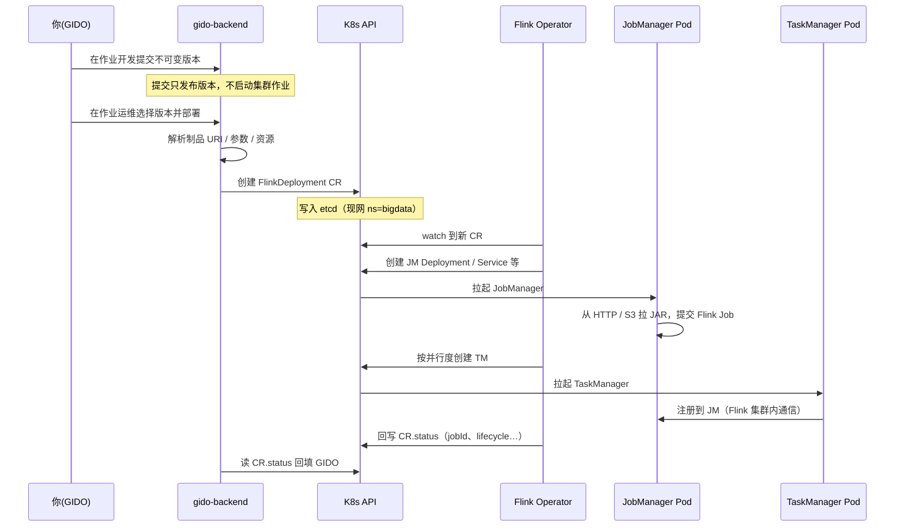
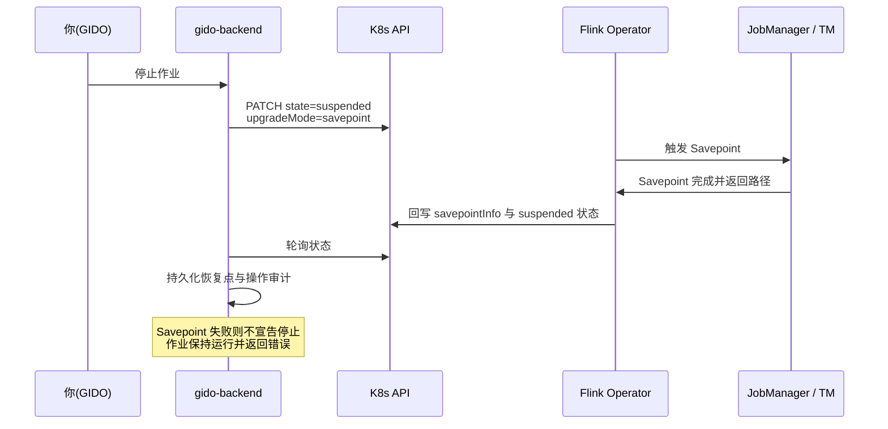

# GIDO Stream · Flink Operator 答疑（CR / JM / TM / 停止与恢复）

面向内部联调与运维：说明 GIDO 如何通过 **Flink Kubernetes Operator** 提交 JAR/SQL，以及停止后再上线时状态如何处理。

> 相关总览见 [FLINK_ARCHITECTURE.md](./FLINK_ARCHITECTURE.md)。作业 CR 所在命名空间由 `FLINK_OPERATOR_NAMESPACE` 统一配置；提交、状态同步与停止都使用同一配置，不再猜测其它命名空间。

---

## 1. CR 是什么？

**CR = Custom Resource（自定义资源）**。

在你们环境里，指 Kubernetes 里的 **`FlinkDeployment`** 对象，例如：

- `gido-jar-1-204`（JAR 作业，命名含 workspace / job id）
- `gido-sql-…`（SQL 作业）

Kuboard 里看到的那条 Flink 相关「组件 / 自定义资源」，通常就是这条 CR。  
它**不是** JAR 文件本身，而是一份「期望跑什么样的 Flink 应用」的声明。

---

## 2. 整体怎么跑起来？

**GIDO 不自己拉起 JM/TM**，也不和 Operator 走私有 RPC。

### 提交时序



### 默认停止时序（Savepoint 挂起）



### 文字链路（对照）

```
你（GIDO UI）
    → gido-backend
    → 调用集群自带的 Kubernetes API
    → 创建 / 更新 FlinkDeployment（CR）
    → Flink Operator（集群里的控制器）watch 到 CR
    → Operator 创建 JM / TM 等工作负载
    → JM 拉取 JAR（HTTP 制品或 S3）并启动 Flink Job
    → TM 向 JM 注册，作业在 Flink 集群内运行
    → Operator 把 status（jobId、lifecycle 等）写回 CR
    → GIDO 读 CR.status 回填运维页
```

要点：

| 角色 | 做什么 |
|------|--------|
| **GIDO** | 写 CR（jarURI、入口类、并行度、资源、配置…）；读 status；默认停止时用 Savepoint 挂起；恢复时显式选择恢复点 |
| **K8s API** | 集群自带的控制面接口（见下节）；所有对象经它读写 |
| **Flink Operator** | 根据 CR 期望状态落地 / 回收 JM、TM，回写 status |
| **JM / TM** | 真正跑 Flink；作业期通信是 Flink 自己的，**不经过** Operator |

---

## 3. K8s API 是啥？是我们写的吗？

**是 Kubernetes 系统自带的 API Server**，不是 GIDO 业务服务。

- 每个集群都有 `kube-apiserver`
- `kubectl`、Kuboard、Flink Operator、`gido-backend` 都是它的**客户端**
- GIDO 用官方 Python `kubernetes` 客户端：`create` / `get` / `list` / `delete` `FlinkDeployment`

你们写的是「何时调用、CR 里填什么」；**API 本身是集群能力**。

---

## 4. JM / TM 分别怎么部署？靠 Operator 通信吗？

### 谁创建

都由 **Operator 根据同一条 `FlinkDeployment` CR** 创建，不是 GIDO 直接 `kubectl create deploy`。

### 「JM 是 Deployment，TM 是 Pod」对吗？

**大体对，是简化说法：**

| 角色 | 常见形态 | 含义 |
|------|----------|------|
| **JM** | 多为 **Deployment**（下面再挂 Pod） | 控制面要稳定：挂了自动拉起、名字相对固定、方便挂 REST Service |
| **TM** | 常直接看到 **一个个 Pod**（有的环境也会是 Deployment） | 按并行度 / 槽位扩缩的工作节点 |

两者最终都是 **Pod 在跑进程**。差别是：有没有 Deployment 这层托管、谁负责扩缩。

### 通信关系

- **GIDO ↔ Operator**：只通过 **K8s API 上的 CR**（声明与状态）
- **JM ↔ TM**：Flink 集群内协议（任务调度、数据交换）
- Operator **不**转发作业数据面流量

---

## 5. 点「停止」再「重启」，会从 checkpoint / savepoint 续跑吗？

### 结论（当前默认）

**计划停止会先生成 Savepoint，再把 FlinkDeployment 挂起。**
下次重启默认选择最近一个成功 Savepoint，也可以在作业运维中选择历史 Savepoint，或显式选择无状态启动。

### 停止时

1. GIDO 把 `spec.job.upgradeMode` 设为 `savepoint`
2. GIDO 把 `spec.job.state` 设为 `suspended`
3. Operator 触发并完成 Savepoint 后停止作业
4. GIDO 保存 Savepoint 路径、作业版本、并行度和操作者审计

若 Savepoint 失败或超时，GIDO 不会把作业标成“已停止”，也不会静默退化为无状态停止。

### 再次上线时

1. 在作业运维选择已发布版本
2. 选择“最近 Savepoint / 指定 Savepoint / 无状态启动”
3. 可覆盖并行度、JM/TM CPU/内存、Slots、TM 副本数和高级 Flink 参数
4. 对保留的 suspended CR 恢复为 `running`；需要重建时写入 `initialSavepointPath`

| 东西 | 停止后 | 再次上线默认 |
|------|--------|----------------|
| CR / JM / TM | CR 保留并进入 suspended；运行 Pod 由 Operator 回收 | CR 恢复或按选择重建 |
| 运行中状态 | 保存为可审计 Savepoint | 默认从最近成功 Savepoint 恢复 |
| 普通 checkpoint | 继续作为故障恢复/诊断信息 | 不当作用户长期恢复点 |
| 无状态启动 | 不默认执行 | 必须显式选择并确认会丢状态 |

“强制停止”仍可删除 CR，但属于高风险操作，只在默认 Savepoint 停止无法完成且用户明确确认时使用。

---

## 6. 为什么停止/状态同步不能猜多个 namespace？

曾出现过：对一个命名空间操作成功，又对无权命名空间继续猜测，最终接口报 403，但集群对象已变化。

现在提交、状态同步、Savepoint 挂起、恢复和强制删除都只使用 `FLINK_OPERATOR_NAMESPACE`。这既避免误操作，也让 RBAC 权限边界可预测。

---

## 7. 名词速查

| 名词 | 含义 |
|------|------|
| **CR / FlinkDeployment** | 作业在 K8s 上的声明对象 |
| **Operator** | 盯着 CR、创建/回收 JM·TM 的控制器 |
| **JM** | JobManager，控制面 |
| **TM** | TaskManager，执行面 |
| **K8s API** | 集群控制面接口（系统自带） |
| **stateless** | 无状态启动：明确丢弃已有状态，只能在高级操作中显式选择 |
| **checkpoint** | Flink 自动故障恢复状态，由 Flink 管理生命周期 |
| **savepoint** | 用户/平台管理的持久恢复点，用于计划停止、升级和恢复 |

---

## 8. 相关代码入口（便于对照）

| 行为 | 位置（约） |
|------|------------|
| 组装并提交 `FlinkDeployment` | `gido/backend/app/services/flink_operator_submit.py` |
| 默认有状态停止 | `streaming.py` → `stop_job`；`flink_operator_submit.py` → Savepoint suspend/wait |
| 部署与恢复 | `streaming.py` → `deploy_job` / `restart_job` |
| 强制无状态停止 | `streaming.py` → 兼容 `cancel_job` + `delete_flink_deployment` |
