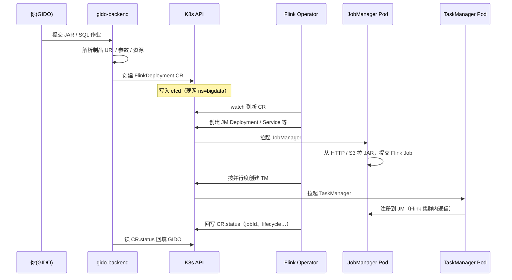
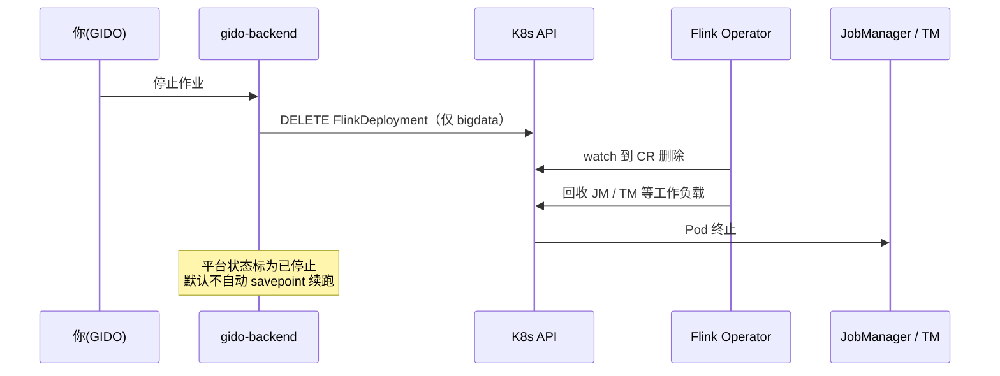

# GIDO Stream · Flink Operator 答疑（CR / JM / TM / 停止与恢复）

面向内部联调与运维：说明 GIDO 如何通过 **Flink Kubernetes Operator** 提交 JAR/SQL，以及停止后再上线时状态如何处理。

> 相关总览见 [FLINK_ARCHITECTURE.md](./FLINK_ARCHITECTURE.md)。现网作业 CR 一般在命名空间 **`bigdata`**（停止逻辑固定操作该 ns）。

---

## 1. CR 是什么？

**CR = Custom Resource（自定义资源）**。

在你们环境里，指 Kubernetes 里的 **`FlinkDeployment`** 对象，例如：

- `gido-jar-1-204`（JAR 作业，命名含 workspace / job id）
- `gido-sql-…`（SQL 作业）

Kuboard 里看到的那条 Flink 相关「组件 / 自定义资源」，通常就是这条 CR。  
它**不是** JAR 文件本身，而是一份「期望跑什么样的 Flink 应用」的声明。

---

## 2. 整体怎么跑起来？

**GIDO 不自己拉起 JM/TM**，也不和 Operator 走私有 RPC。

### 提交时序



### 停止时序



### 文字链路（对照）

```
你（GIDO UI）
    → gido-backend
    → 调用集群自带的 Kubernetes API
    → 创建 / 更新 / 删除 FlinkDeployment（CR）
    → Flink Operator（集群里的控制器）watch 到 CR
    → Operator 创建 JM / TM 等工作负载
    → JM 拉取 JAR（HTTP 制品或 S3）并启动 Flink Job
    → TM 向 JM 注册，作业在 Flink 集群内运行
    → Operator 把 status（jobId、lifecycle 等）写回 CR
    → GIDO 读 CR.status 回填运维页
```

要点：

| 角色 | 做什么 |
|------|--------|
| **GIDO** | 写 CR（jarURI、入口类、并行度、资源、配置…）；读 status；停止时删 CR |
| **K8s API** | 集群自带的控制面接口（见下节）；所有对象经它读写 |
| **Flink Operator** | 根据 CR 期望状态落地 / 回收 JM、TM，回写 status |
| **JM / TM** | 真正跑 Flink；作业期通信是 Flink 自己的，**不经过** Operator |

---

## 3. K8s API 是啥？是我们写的吗？

**是 Kubernetes 系统自带的 API Server**，不是 GIDO 业务服务。

- 每个集群都有 `kube-apiserver`
- `kubectl`、Kuboard、Flink Operator、`gido-backend` 都是它的**客户端**
- GIDO 用官方 Python `kubernetes` 客户端：`create` / `get` / `list` / `delete` `FlinkDeployment`

你们写的是「何时调用、CR 里填什么」；**API 本身是集群能力**。

---

## 4. JM / TM 分别怎么部署？靠 Operator 通信吗？

### 谁创建

都由 **Operator 根据同一条 `FlinkDeployment` CR** 创建，不是 GIDO 直接 `kubectl create deploy`。

### 「JM 是 Deployment，TM 是 Pod」对吗？

**大体对，是简化说法：**

| 角色 | 常见形态 | 含义 |
|------|----------|------|
| **JM** | 多为 **Deployment**（下面再挂 Pod） | 控制面要稳定：挂了自动拉起、名字相对固定、方便挂 REST Service |
| **TM** | 常直接看到 **一个个 Pod**（有的环境也会是 Deployment） | 按并行度 / 槽位扩缩的工作节点 |

两者最终都是 **Pod 在跑进程**。差别是：有没有 Deployment 这层托管、谁负责扩缩。

### 通信关系

- **GIDO ↔ Operator**：只通过 **K8s API 上的 CR**（声明与状态）
- **JM ↔ TM**：Flink 集群内协议（任务调度、数据交换）
- Operator **不**转发作业数据面流量

---

## 5. 点「停止」再「上线」，会从 checkpoint / savepoint 续跑吗？

### 结论（当前默认）

**不会自动续跑。**  
同名 `gido-jar-1-204` 可以再出现，但是**新建的一条 CR**，默认 **`upgradeMode: stateless`（无状态重新开跑）**。

### 停止时

1. GIDO **删除** `FlinkDeployment`
2. Operator 回收 JM / TM
3. **不会**先做正式 savepoint 再删（当前为直接删 CR）

因此：CR / JM / TM 没了；内存中作业状态没了。  
若配置了 `state.checkpoints.dir`（如 S3），**存储上可能残留旧 checkpoint 文件**，但默认**下次不会自动加载**。

### 再次上线时

1. GIDO 再创建同名 CR（名字由 workspace + job id 推导，故常相同）
2. 新 JM / TM、**新的 Flink `jobId`**
3. 默认不填 `initialSavepointPath`，不按 last-state 恢复

| 东西 | 停止后 | 再次上线默认 |
|------|--------|----------------|
| CR / JM / TM | 删除 | 新建 |
| 同名 `gido-jar-*` | 对象没了 | 名字复用，对象是新的 |
| 运行中状态 | 丢失 | 不自动恢复 |
| 存储上旧 checkpoint 文件 | 可能仍在 | **默认不用** |
| 从 savepoint 续跑 | — | **默认不会** |

若以后要「停了再上线接着算」，需要额外能力（停止前 savepoint、再次提交带恢复路径，或配置 `upgradeMode=savepoint` / `last-state` 等）。**不是当前停止按钮的默认行为。**

---

## 6. 停止报 403 但 Kuboard 里已经没了？

曾出现过：对 **`bigdata` 删除成功**，又对无权的 **`flink` ns 再猜一次 DELETE → 403**，接口失败，但 CR 已在 bigdata 删掉。

当前停止逻辑已改为**只操作 `bigdata`**，避免「集群已停、平台却报失败」。若平台状态未对齐，在运维页做一次**状态同步**即可（CR 不存在则回填已停止）。

---

## 7. 名词速查

| 名词 | 含义 |
|------|------|
| **CR / FlinkDeployment** | 作业在 K8s 上的声明对象 |
| **Operator** | 盯着 CR、创建/回收 JM·TM 的控制器 |
| **JM** | JobManager，控制面 |
| **TM** | TaskManager，执行面 |
| **K8s API** | 集群控制面接口（系统自带） |
| **stateless** | 默认升级/重建模式：不从状态恢复 |
| **checkpoint / savepoint** | Flink 状态快照；有目录不等于停止后再上线会自动用 |

---

## 8. 相关代码入口（便于对照）

| 行为 | 位置（约） |
|------|------------|
| 组装并提交 `FlinkDeployment` | `gido/backend/app/services/flink_operator_submit.py` |
| 默认 `upgradeMode` | `FLINK_OPERATOR_UPGRADE_MODE`，默认 `stateless`（`operator_resources.py` / `config.py`） |
| 停止：删 CR（仅 bigdata） | `streaming.py` → `cancel_job` + `delete_flink_deployment` |
