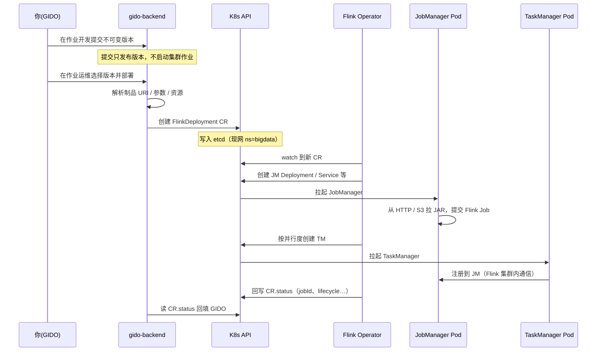
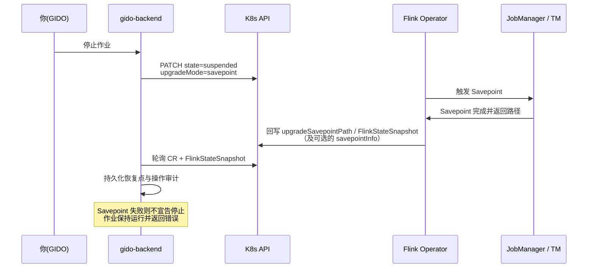

# GIDO Stream · Flink Operator 答疑（CR / JM / TM / 停止与恢复）

面向内部联调与运维：说明 GIDO 如何通过 **Flink Kubernetes Operator** 提交 JAR/SQL，以及停止后再上线时状态如何处理。

> 相关总览见 [FLINK_ARCHITECTURE.md](./FLINK_ARCHITECTURE.md)。作业 CR 所在命名空间由 `FLINK_OPERATOR_NAMESPACE` 统一配置；提交、状态同步与停止都使用同一配置，不再猜测其它命名空间。

---

## 1. CR 是什么？

**CR = Custom Resource（自定义资源）**。

在你们环境里，指 Kubernetes 里的 **`FlinkDeployment`** 对象，例如：

- `gido-jar-1-204`（JAR 作业，命名含 workspace / job id）
- `gido-sql-…`（SQL 作业）

Kuboard 里看到的那条 Flink 相关「组件 / 自定义资源」，通常就是这条 CR。  
它**不是** JAR 文件本身，而是一份「期望跑什么样的 Flink 应用」的声明。

---

## 2. 整体怎么跑起来？

**GIDO 不自己拉起 JM/TM**，也不和 Operator 走私有 RPC。

### 提交时序



### 默认停止时序（Savepoint 挂起）



### 文字链路（对照）

```
你（GIDO UI）
    → gido-backend
    → 调用集群自带的 Kubernetes API
    → 创建 / 更新 FlinkDeployment（CR）
    → Flink Operator（集群里的控制器）watch 到 CR
    → Operator 创建 JM / TM 等工作负载
    → JM 拉取 JAR（HTTP 制品或 S3）并启动 Flink Job
    → TM 向 JM 注册，作业在 Flink 集群内运行
    → Operator 把 status（jobId、lifecycle 等）写回 CR
    → GIDO 读 CR.status 回填运维页
```

要点：

| 角色 | 做什么 |
|------|--------|
| **GIDO** | 写 CR（jarURI、入口类、并行度、资源、配置…）；读 status；默认停止时用 Savepoint 挂起；恢复时显式选择恢复点 |
| **K8s API** | 集群自带的控制面接口（见下节）；所有对象经它读写 |
| **Flink Operator** | 根据 CR 期望状态落地 / 回收 JM、TM，回写 status |
| **JM / TM** | 真正跑 Flink；作业期通信是 Flink 自己的，**不经过** Operator |

---

## 3. K8s API 是啥？是我们写的吗？

**是 Kubernetes 系统自带的 API Server**，不是 GIDO 业务服务。

- 每个集群都有 `kube-apiserver`
- `kubectl`、Kuboard、Flink Operator、`gido-backend` 都是它的**客户端**
- GIDO 用官方 Python `kubernetes` 客户端：`create` / `get` / `list` / `delete` `FlinkDeployment`

你们写的是「何时调用、CR 里填什么」；**API 本身是集群能力**。

---

## 4. JM / TM 分别怎么部署？靠 Operator 通信吗？

### 谁创建

都由 **Operator 根据同一条 `FlinkDeployment` CR** 创建，不是 GIDO 直接 `kubectl create deploy`。

### 「JM 是 Deployment，TM 是 Pod」对吗？

**大体对，是简化说法：**

| 角色 | 常见形态 | 含义 |
|------|----------|------|
| **JM** | 多为 **Deployment**（下面再挂 Pod） | 控制面要稳定：挂了自动拉起、名字相对固定、方便挂 REST Service |
| **TM** | 常直接看到 **一个个 Pod**（有的环境也会是 Deployment） | 按并行度 / 槽位扩缩的工作节点 |

两者最终都是 **Pod 在跑进程**。差别是：有没有 Deployment 这层托管、谁负责扩缩。

### 通信关系

- **GIDO ↔ Operator**：只通过 **K8s API 上的 CR**（声明与状态）
- **JM ↔ TM**：Flink 集群内协议（任务调度、数据交换）
- Operator **不**转发作业数据面流量

---

## 5. 点「保存并停止」再「重启」，会从 checkpoint / savepoint 续跑吗？

### 产品契约（对外承诺）

| 结果 | 用户看到的状态 | 恢复点 |
|------|----------------|--------|
| 成功 | 已停止 | 本次成功路径入库，可选用 |
| 失败 | **仍为运行中**（操作记录失败） | 无本次成功点；不静默无状态停掉 |
| 清理集群 | 已停止（已清理） | 无；须二次确认丢弃状态 |

内部可能对半成品 `suspended` 做 resume 补偿，但对外不呈现「停了又起」或长期「停止失败待确认」。
仅当 CR 已挂起且无可用恢复点时，才进入少数「停止未完成」需处理态。

### 结论（当前默认）

**计划停止会先生成 Savepoint，再把 FlinkDeployment 挂起。**
下次重启默认选择最近一个成功 Savepoint，也可以在作业运维中选择历史 Savepoint，或显式选择无状态启动。

### 停止时

1. GIDO 把 `spec.job.upgradeMode` 设为 `savepoint`，并确保 CR 上存在
   `state.savepoints.dir`（及兼容键 `execution.checkpointing.savepoint-dir`）
2. GIDO 把 `spec.job.state` 设为 `suspended`
3. Operator 触发并完成 Savepoint 后停止作业（1.15 默认写入 `FlinkStateSnapshot`，
   升级路径还会写 `jobStatus.upgradeSavepointPath`）
4. GIDO 轮询上述路径（并忽略停止前已存在的 Snapshot），保存恢复点与操作审计

若 Savepoint 失败或超时，GIDO 不会把作业标成“已停止”，也不会静默退化为无状态停止。
详见下方 [§8 QA：计划停止超时](#8-qa计划停止-savepoint-一直超时checkpoint-却正常)。

### 再次上线时

1. 在作业运维选择已发布版本
2. 选择“最近 Savepoint / 指定 Savepoint / 无状态启动”
3. 可覆盖并行度、JM/TM CPU/内存、Slots、TM 副本数和高级 Flink 参数
4. 对保留的 suspended CR 恢复为 `running`；需要重建时写入 `initialSavepointPath`

| 东西 | 停止后 | 再次上线默认 |
|------|--------|----------------|
| CR / JM / TM | CR 保留并进入 suspended；运行 Pod 由 Operator 回收 | CR 恢复或按选择重建 |
| 运行中状态 | 保存为可审计 Savepoint | 默认从最近成功 Savepoint 恢复 |
| 普通 checkpoint | 继续作为故障恢复/诊断信息 | 不当作用户长期恢复点 |
| 无状态启动 | 不默认执行 | 必须显式选择并确认会丢状态 |

“强制停止”仍可删除 CR，但属于高风险操作，只在默认 Savepoint 停止无法完成且用户明确确认时使用。

---

## 6. 为什么停止/状态同步不能猜多个 namespace？

曾出现过：对一个命名空间操作成功，又对无权命名空间继续猜测，最终接口报 403，但集群对象已变化。

现在提交、状态同步、Savepoint 挂起、恢复和强制删除都只使用 `FLINK_OPERATOR_NAMESPACE`。这既避免误操作，也让 RBAC 权限边界可预测。

---

## 7. 名词速查

| 名词 | 含义 |
|------|------|
| **CR / FlinkDeployment** | 作业在 K8s 上的声明对象 |
| **Operator** | 盯着 CR、创建/回收 JM·TM 的控制器 |
| **JM** | JobManager，控制面 |
| **TM** | TaskManager，执行面 |
| **K8s API** | 集群控制面接口（系统自带） |
| **stateless** | 无状态启动：明确丢弃已有状态，只能在高级操作中显式选择 |
| **checkpoint** | Flink 自动故障恢复状态，由 Flink 管理生命周期 |
| **savepoint** | 用户/平台管理的持久恢复点，用于计划停止、升级和恢复 |
| **FlinkStateSnapshot** | Operator 1.10+ / 1.15 默认的 Snapshot CR；计划停止路径常写在这里而非旧 `savepointInfo` |
| **upgradeSavepointPath** | `jobStatus` 上的升级/挂起 Savepoint 路径字段 |

---

## 8. QA：计划停止 Savepoint 一直超时，Checkpoint 却正常

> 实战案例（测试环境 `bigdata`，Operator 1.15 + Flink 2.0.1，约 2026-08）。  
> 相关修复：`e7c66bb`（目录键 / 状态观察 / RBAC）、`184b083`（忽略历史 Snapshot）。

### 8.1 现象

| 表象 | 细节 |
|------|------|
| 运维页「Savepoint 停止」失败 | 操作记录 / 恢复点：`Timed out waiting for savepoint of FlinkDeployment …`（默认约 **300s**） |
| 停止过程中 CR | 长时间 `spec.job.state=suspended` 且 `jobStatus.state=RUNNING`，随后被 GIDO **resume** 回 `running` |
| Checkpoint | JM REST / 运维诊断显示周期 Checkpoint **正常** |
| `savepointInfo` | 多为空壳：`savepointHistory: []`，GIDO 解析结果 `(None, None, None)` |
| `upgradeSavepointPath` | 轮询窗口内常为 `None`（或字段根本不在 `jobStatus` keys 里） |

### 8.2 根因（多坑叠加）

**坑 1 — 只认废弃字段 `savepointInfo`**  
Operator 1.15 默认 `kubernetes.operator.snapshot.resource.enabled=true`，计划停止 / 升级 Savepoint 由 **`FlinkStateSnapshot`** 跟踪，路径还可能写在 **`upgradeSavepointPath`**。旧逻辑只轮询 `status.jobStatus.savepointInfo`，集群上 SP 已 COMPLETED，平台仍判超时。

**坑 2 — RBAC 缺少 `flinkstatesnapshots`**  
Backend SA（如 `flink-service-account-dev`）Role 仅有 `flinkdeployments` / `flinksessionjobs` 时，`list flinkstatesnapshots` → **403**。即使 Snapshot 已在 etcd，GIDO 也看不见。

**坑 3 — 只写了非官方目录键**  
GIDO 曾只注入 `execution.checkpointing.savepoint-dir`，未写 Flink 官方的 **`state.savepoints.dir`**（同集群手工样例 `basic-example` 有后者）。Checkpoint 用 `state.checkpoints.dir`，故 CP 成功 ≠ SP 配置完整。

**坑 4 — 超时后 resume + 历史 Snapshot 残留**  
超时路径会 `resume` 作业；Operator 已完成的 `FlinkStateSnapshot` 仍留在命名空间。若后续等待逻辑「见 COMPLETED 即成功」且不忽略停止前已有 Snapshot，会把**旧路径**误认为本次停止成功。

**坑 6 — CR 残留 `status.error=Job Not Found` 导致一点停止就失败**  
强停/失败停止后 Operator 常把 `Job Not Found` 留在 `status.error` 上，即使新 `jobId` 已在 `INITIALIZING`/`RUNNING`。旧逻辑把任意 `status.error` 当硬失败，会在数秒内 `failed while saving: Job Not Found` 并 resume，前端出现「停止失败待确认」。应仅在 job/lifecycle 真正 FAILED 时采纳该错误；陈旧 Job Not Found 在启动/运行态下忽略。

**坑 7 — 每次停止都 PATCH 相同的 `flinkConfiguration`**  
为补 `state.savepoints.dir`，若与 `suspended` **同一次**写入（或目录已存在仍重复 PATCH），Operator 会当成配置变更升级，作业被重启；GIDO 随即 `Job Not Found` → resume，WebUI 看到「停了又起」。正确做法：仅在目录缺失时先单独补配置并等 `RUNNING`，再只 PATCH `state=suspended`。

**坑 8 — `upgradeSavepointPath` 残留 Checkpoint 路径**  
last-state / 失败恢复后，CR 上 `jobStatus.upgradeSavepointPath` 可能指向 `.../flink/checkpoints/.../chk-N`。旧逻辑把任意非空 upgrade 路径当成「Savepoint 已完成」，随后去等 `suspend`，作业其实从未做完计划停止 SP → `Timed out waiting for … to suspend`，且 Snapshot 仍只有历史那条。应忽略 checkpoint URI，只认 savepoint 目录 / `FlinkStateSnapshot`。

### 8.3 怎么在 Pod 里快速核对（无本机 kubectl 时）

进 **gido-backend** Pod（`/app`），用自带客户端：

```bash
# RBAC：应为 ok，而非 403
python3 - <<'PY'
from app.services.flink_operator_submit import _custom_objects_api
api = _custom_objects_api()
out = api.list_namespaced_custom_object(
    group="flink.apache.org", version="v1beta1",
    namespace="bigdata", plural="flinkstatesnapshots", _request_timeout=10,
)
print("ok, count=", len(out.get("items") or []))
PY

# 目录键与 upgradeMode
python3 - <<'PY'
import os, json
from app.services.flink_operator_submit import read_flink_deployment
print("ENV UPGRADE_MODE =", os.environ.get("FLINK_OPERATOR_UPGRADE_MODE"))
print("ENV SAVEPOINT_DIR =", os.environ.get("FLINK_OPERATOR_SAVEPOINT_DIR"))
cr = read_flink_deployment("gido-sql-1-308", "bigdata")  # 换成实际名
job = ((cr.get("spec") or {}).get("job") or {})
fc = (cr.get("spec") or {}).get("flinkConfiguration") or {}
print("live upgradeMode =", job.get("upgradeMode"), "state =", job.get("state"))
print("state.savepoints.dir =", fc.get("state.savepoints.dir"))
print("execution.checkpointing.savepoint-dir =", fc.get("execution.checkpointing.savepoint-dir"))
print("upgradeSavepointPath =", ((cr.get("status") or {}).get("jobStatus") or {}).get("upgradeSavepointPath"))
PY

# 该作业相关 Snapshot
python3 - <<'PY'
from app.services.flink_operator_submit import list_flink_state_snapshots
for i in list_flink_state_snapshots(namespace="bigdata", deployment_name="gido-sql-1-308"):
    m, s = i.get("metadata") or {}, i.get("status") or {}
    print(m.get("name"), s.get("state"), (s.get("path") or "")[:90], s.get("error"))
PY
```

操作记录（示例表）：

```sql
SELECT id, status, error_message, completed_at
FROM dw_streaming_operations
WHERE job_id = 308 AND operation_type = 'stop'
ORDER BY id DESC LIMIT 5;
```

### 8.4 解决方案（已落地）

| 项 | 做法 |
|----|------|
| 目录 | 提交 CR 时同时写 `state.savepoints.dir` + `execution.checkpointing.savepoint-dir`；计划停止 PATCH 时对已有作业补写 |
| 观察 | `wait_for_completed_savepoint` 认 `savepointInfo`、`upgradeSavepointPath`、以及相关 `FlinkStateSnapshot` |
| 新鲜度 | 停止前收集已有 Snapshot 的 path/name，等待时**忽略**，只认本次新产生的 COMPLETED |
| RBAC | Role `gido-backend-operator`（及部署清单）增加 `flinkstatesnapshots`；deployment 侧 `apps/bigdata/gido/gido.yaml` 由 ArgoCD sync |
| 产品行为 | 超时仍 resume + 记失败，作业回到「运行中」；不静默无状态停止；不长期 STOP_FAILED |

生产若与测试分离部署：除 backend 镜像外，须运维同步 Role（话术见内部沟通）；仅合代码不够。

### 8.5 运维产品契约（状态 / 操作 / 重启分流）

#### 用户可见状态

| UI 约等于 | lifecycle_state | 平台 status | 集群预期 |
|-----------|-----------------|-------------|---------|
| 已批准待部署 | `approved` | draft | 无 CR |
| 正在部署 / 运行中 | `DEPLOYING` / `RUNNING` | running | CR running |
| 正在保存状态 / 正在挂起 | `SAVING_STATE` / `SUSPENDING` | running | 计划停止中 |
| 已停止 | `SUSPENDED` | cancelled | CR 保留、TM≈0 |
| 已停止（已清理） | `FORCE_STOPPED` | cancelled | CR 已删 |
| 部署失败 / 恢复失败 | `DEPLOY_FAILED` / `RESTORE_FAILED` | failed 等 | 视情况 |

#### 操作契约

| 操作 | API | 成功 | 失败 |
|------|-----|------|------|
| 部署 | `POST .../deploy` | `RUNNING` | `DEPLOY_FAILED` |
| 保存并停止 | `POST .../stop`（默认超时 **300s**） | `SUSPENDED` + 恢复点 completed | resume 回运行中 + 操作失败 |
| 清理集群 | `POST .../cancel`（操作类型 `force-stop`） | `FORCE_STOPPED`，无恢复点 | 操作失败 |
| 重启/恢复 | `POST .../restart` | 见下表分流 | `RESTORE_FAILED` |

#### 重启分流（`classify_flink_restart_action`）

| CR 事实 | 恢复点 / 模式 | 动作 |
|---------|---------------|------|
| 缺失 / Terminating / stuck（`spec=running` 但仍 SUSPENDED/FINISHED） | 任意 | 回收 CR（超时清 finalizer）再带 path 重建 |
| 干净挂起且 TM replicas=0 | Savepoint path | `savepointRedeployNonce` + path → **等到 job RUNNING 且 TM≥1** |
| 挂起但 Pod 未缩完 / 终态残留 | Savepoint path | 重建（不赌 in-place）→ 同上就绪门闩 |
| 仍在跑、同 release、无新 path | 热重启 | `restartNonce` → 就绪门闩 |
| `restore_mode=last-state` | 无平台 SP | Operator `upgradeMode=last-state`（HA/最近 CP） |
| 显式无状态 | — | 强制重建 |

#### 顶级就绪契约（对标 VVP / Operator 生产）

| 阶段 | 成功条件 |
|------|----------|
| 保存并停止 | 新 Savepoint path + `spec=suspended` + **TM replicas=0**（缩容超时仍保留 SP，重启走 replace） |
| 标成 RUNNING | `jobStatus.state=RUNNING` + **新 jobId** + **TM≥1**；否则保持 `RESTORING` |
| 状态同步 | JM Connection refused → `JM_UNREACHABLE`，不得长期假 RUNNING；`DEPLOYING`/`RESTORING` 缺 CR 不标 SUSPENDED |

同步契约：`DEPLOYING` / `RESTORING` 期间 CR 短暂消失**不得**回填为 `SUSPENDED`。

### 8.6 优化与后续建议

1. **默认超时**：API/运维页默认 **300s**；进度文案标明「正在等待 FlinkStateSnapshot」。
2. **状态机**：`SAVING_STATE` / `SUSPENDING` 期间禁止状态同步把作业提前标成已挂起且清空 `flink_job_id`；`RESTORING`/`DEPLOYING` 缺 CR 保持原 lifecycle。
3. **后台等待（技术债）**：停止 finalize 仍用进程内 daemon 线程，多副本 / 滚动时可能丢等待 → 作业长期停在 `SAVING_STATE`。中长期改为可恢复任务队列或 Operator 事件驱动；在此之前运维可查操作记录并必要时重试「保存并停止」。
4. **E2E**：见 [STREAM_STATEFUL_OPERATIONS_E2E.md](./STREAM_STATEFUL_OPERATIONS_E2E.md)。
5. **运维排障口令**：先看操作记录是否 `Timed out waiting for savepoint` → 再看 Snapshot CR 是否已有 COMPLETED → 区分「真没做成」与「做成了平台没看见」。
6. **卡住重启**：平台显示 RUNNING 但 JM `Connection refused`、Pod=0 时，升级含分流逻辑的 backend 后对「从最近恢复点重启」应走 replace；必要时手工清 finalizer。

---

## 9. 相关代码入口（便于对照）

| 行为 | 位置（约） |
|------|------------|
| 组装并提交 `FlinkDeployment` | `gido/backend/app/services/flink_operator_submit.py` |
| Savepoint 目录 / 等待 / Snapshot | 同上：`_base_flink_conf`、`suspend_flink_deployment`、`wait_for_completed_savepoint`、`list_flink_state_snapshots` |
| 默认有状态停止 | `streaming.py` → `stop_streaming_job_with_savepoint` |
| 部署与恢复 | `streaming.py` → `deploy_job` / `restart_job` |
| 强制无状态停止 | `streaming.py` → 兼容 `cancel_job` + `delete_flink_deployment` |
| 测试环境 Role | `deployment` 仓库 `apps/bigdata/gido/gido.yaml`；模板见 `k8s/gido.yaml` |
