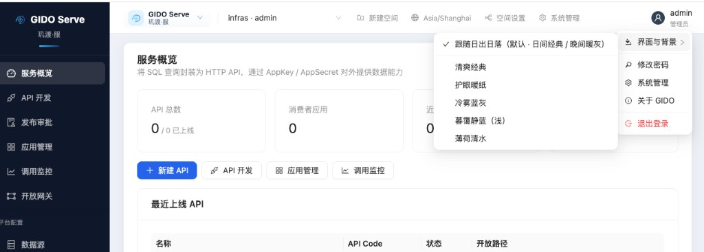
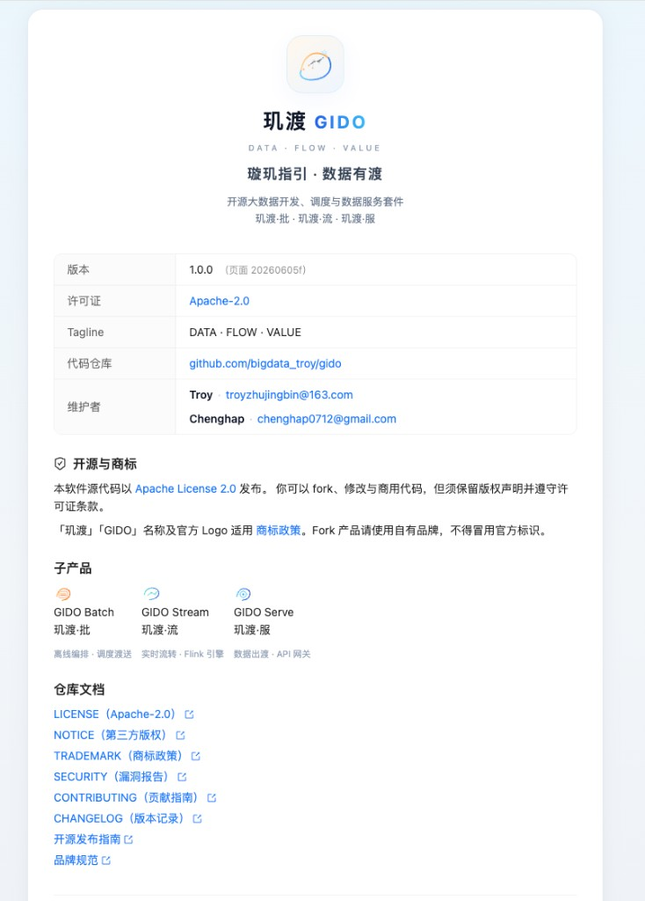

# 玑渡 GIDO · 产品概览

> **璇玑指引 · 数据有渡** — DATA · FLOW · VALUE  
> 开源大数据开发、调度与数据服务套件 · Apache-2.0

本文档帮助你在 **5 分钟内**了解 GIDO 三大子产品长什么样、能做什么，并给出本地体验路径。

---

## 三大子产品

| 子产品 | 定位 | 典型能力 |
|--------|------|----------|
| **GIDO Batch**（玑渡·批） | 离线开发与治理 | SQL 开发、工作流 DAG、调度发布、数据集成、数据地图、质量与探查 |
| **GIDO Stream**（玑渡·流） | 实时流计算 | Flink SQL / JAR 开发、作业运维、发布审批、Flink 集群连接与健康 |
| **GIDO Serve**（玑渡·服） | 数据服务化 | SQL 封装 HTTP API、应用授权、调用监控、开放网关 |

登录后可在顶部 **产品切换器** 一键进入任一子产品，无需重复登录。

---

## 界面预览

### 登录与产品入口

清爽浅色登录页，展示品牌星徽与三件套说明；登录后弹出 **「进入 玑渡 GIDO」** 选择 Batch / Stream / Serve。

<p align="center">
  
</p>

<p align="center">
  
</p>

---

### GIDO Batch · 离线开发与治理

面向 **离线批处理** 全链路：开发生产、工作流、集成、运维、审批，以及数据字典 / 探查 / 质量等治理能力。

<p align="center">
  
</p>

**核心菜单**

| 模块 | 说明 |
|------|------|
| 数据开发 | 脚本节点树、SQL 编辑器、运行与结果面板 |
| 工作流 | 可视化 DAG 编排，对接 DolphinScheduler 发布 |
| 数据集成 | 多源同步与 CDC 配置 |
| 运维中心 | 实例监控、趋势与告警 |
| 发布审批 | 发布前审批流 |
| 数据治理 | 数据字典、探查、质量规则 |

---

### GIDO Stream · 实时流计算

面向 **Flink 实时作业**：开发态与运维态分离，支持 SQL / JAR，多套 Flink 集群连接与健康检查。

<p align="center">
  
</p>

**核心菜单**

| 模块 | 说明 |
|------|------|
| 作业开发 | Flink SQL / JAR 任务创建与编辑 |
| 作业运维 | 运行中作业监控与管理 |
| 发布审批 | 流作业上线审批 |
| Flink 集群连接 | 多套物理集群 REST / Gateway 配置 |
| 集群与健康 | JobManager / Gateway 健康概览 |

默认全栈已包含 Flink Session + SQL Gateway（`8081` / `8083`），也可对接 K8s 集群（见 `k8s/`）。

---

### GIDO Serve · 数据服务

将 **SQL 查询封装为 HTTP API**，通过 AppKey / AppSecret 对外提供数据能力，含应用管理、调用监控与开放网关。

<p align="center">
  
</p>

**核心菜单**

| 模块 | 说明 |
|------|------|
| 服务概览 | API 总数、消费者应用、调用量与延迟概览 |
| API 开发 | SQL → REST 接口定义与调试 |
| 应用管理 | 调用方 AppKey 授权 |
| 调用监控 | Trace、延迟、错误追踪 |
| 开放网关 | 对外路由与安全策略 |

---

### 个性化与关于

支持多套 **界面主题**（清爽经典、护眼暖纸、冷雾蓝灰等），账号菜单可进入 **关于 GIDO** 查看版本、许可证与维护者信息。

<p align="center">
  
  &nbsp;&nbsp;
  
</p>

---

## 本地体验（5 分钟）

```bash
git clone https://github.com/bigdata_troy/gido.git
cd gido
cp .env.example .env
./start-platform.sh
```

1. 浏览器打开 **http://127.0.0.1:3002**
2. 使用默认账号 **`admin` / `admin123`** 登录（生产环境务必修改）
3. 在弹窗中选择 **玑渡·批 / 流 / 服** 分别体验
4. 右上角账号菜单 → **关于 GIDO** 查看开源信息

| 子产品 | 入口路径 |
|--------|----------|
| GIDO Batch | 登录后选「玑渡·批」，或访问 `/gido/batch/studio` |
| GIDO Stream | 选「玑渡·流」，或访问 `/gido/stream/studio` |
| GIDO Serve | 选「玑渡·服」，或访问 `/gido/service/overview` |

---

## 技术栈与集成

| 层级 | 组件 |
|------|------|
| 前端 | React · Vite · Ant Design |
| 后端 | FastAPI · PostgreSQL 元库 |
| 调度 | Apache DolphinScheduler |
| 流计算 | Apache Flink · SQL Gateway |
| 消息 | Apache Kafka |
| 部署 | Docker Compose 一键全栈 |

---

## 相关链接

- [README](../README.md) — 仓库主文档
- [部署 SOP](../gido/docs/DEPLOYMENT_SOP.md) — 从 Git 到生产
- [GitHub](https://github.com/bigdata_troy/gido) · [Gitee 镜像](https://gitee.com/bigdata_troy/gido)

---

**维护者**：Troy · troyzhujingbin@163.com · Chenghap · chenghap0712@gmail.com
