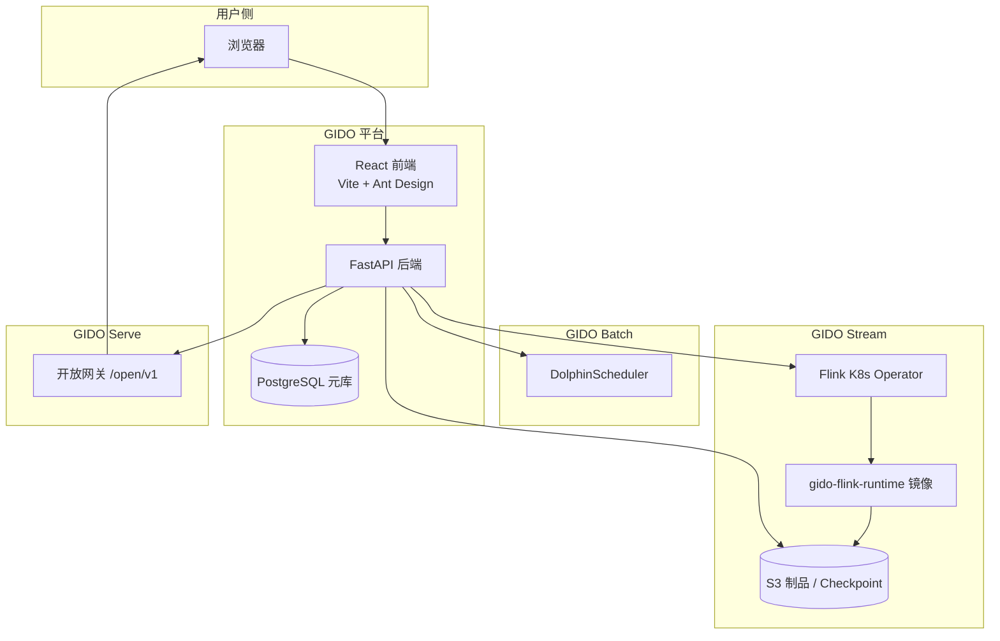

# 玑渡 GIDO · 服务分享

**目标**：帮助听众快速理解 GIDO 是什么、解决什么问题、架构如何设计、当前能力边界，以及如何快速体验与落地。

---

## 1. 开场：我们为什么做 GIDO？

### 1.1 典型痛点（多 Region · 多云视角）

业务出海、两地三中心、集团多云并存时，数据平台往往 **按 Region / 按云各建一套**，痛点集中在「治理要集中、算力与数据要就近」之间的矛盾：

| 痛点 | 多 Region / 多云下的表现 |
|------|--------------------------|
| **平台碎片化** | 新加坡 EKS 一套 Flink 控制台、国内 ACK 一套、离线 DS 又在第三套；账号、审批、审计无法统一，Regional 团队重复造轮子 |
| **流作业与数据绑错 Region** | Checkpoint、Savepoint、Paimon Warehouse、JAR 制品默认写「中心桶」，实时链路跨 Region 拉流，延迟高、出口流量贵，且可能违反数据驻留要求 |
| **一套控制台管不了多套集群** | 各云 Kube Context、命名空间、镜像仓库（ECR / ACR / GHCR）、IRSA 与静态 AK 各不相同；运维要在多个控制台或 kubectl 之间切换 |
| **Flink 版本与运行时分裂** | 存量 Region 仍跑 Flink 1.17，新 Region 上 2.2；Connector、CDC 坐标、镜像 tag 各维护一份，升级与回滚难以标准化 |
| **制品与构建链路跨区域** | JAR 在总部 Nexus 构建，各 Region 作业却要本地 S3/OSS 可读；缺少「保存登记、提交物化、按 Profile 投递」的统一机制 |
| **批 / 流 / 服无法随 Region 一致交付** | 实时已在多云落地，离线调度与数据 API 仍只在单 Region；业务侧体验仍是「三个产品、三套入口、三套权限」 |
| **合规与运维不可视** | 多 Region 谁向哪个桶写了数据、哪条作业绑了哪个集群，缺少中心元数据与 Regional 生效配置的对照视图 |

**共性本质**：不是缺一个 Flink 提交工具，而是缺 **「中心治理 + Regional 算力与存储」** 的可落地架构——同一套 GIDO 管元数据与流程，各 Region 的 K8s、S3、凭证通过 Profile 就地生效。

### 1.2 GIDO 的定位

**GIDO（玑渡）** 面向 **多 Region、多云并存** 场景，提供 **单壳三产品** 的开源大数据中台：

- **中心元库、Regional 算力** — PostgreSQL 统一作业/权限/审批；Flink Operator、S3 制品、Checkpoint 按 **Operator Profile**  per Region / per 云绑定
- **一套账号、一套 RBAC、一套审批** — 批 / 流 / 服与多 Region 作业共用治理面，避免每个 Region 单独建中台
- **开发态与运维态分离** — Studio 写代码，Monitor 看运行；提交时自动物化 JAR 到目标 Region 的 S3 前缀
- **云原生优先** — K8s + Flink Operator + 区域 S3/IRSA；Compose 一键体验用于 PoC，生产路径对齐 EKS / 多集群

一句话：**治理在中心，数据与算力在 Region——让跨 Region、跨云的批 / 流 / 服仍在同一个「渡」上协同。**

---

## 2. 产品全景：三大子产品

登录后通过顶部 **产品切换器** 进入不同工作台，无需重复登录。

| 子产品 | 路由 | 一句话 | 典型用户 |
|--------|------|--------|----------|
| **GIDO Batch**（玑渡·批） | `/gido/batch/*` | 离线编排 · 调度派送 | 数据开发、数仓工程师 |
| **GIDO Stream**（玑渡·流） | `/gido/stream/*` | 实时流转 · Flink 引擎 | 实时开发、流计算运维 |
| **GIDO Serve**（玑渡·服） | `/gido/service/*` | 数据出渡 · API 网关 | 后端开发、数据产品 |

### 2.1 GIDO Batch · 离线开发与治理

| 模块 | 能力 |
|------|------|
| 数据开发 | SQL 脚本编辑、运行、结果面板 |
| 工作流 | 可视化 DAG 编排，对接 DolphinScheduler 发布 |
| 数据集成 | 多源同步、轻量 CDC 配置 |
| 数据治理 | 数据字典、探查、质量规则 |
| 运维中心 | 实例监控、趋势与告警 |
| 发布审批 | 批作业上线前审批 |

**适用场景**：T+1 报表、离线 ETL、工作流调度、数据质量巡检。

### 2.2 GIDO Stream · 实时流计算

| 模块 | 能力 |
|------|------|
| 作业开发 | Flink SQL / JAR 创建、编辑、提交 |
| 作业运维 | 运行监控、批量启停、Savepoint 管理 |
| Operator 集群 | **多套 Flink K8s 集群** 配置（命名空间、镜像、S3、IRSA） |
| 发布审批 | 流作业上线审批 |
| Flink 运行概览 | `FlinkDeployment` 聚合与健康 |

**适用场景**：CDC 入湖、实时宽表、实时指标、JAR 作业托管。

### 2.3 GIDO Serve · 数据服务化

| 模块 | 能力 |
|------|------|
| API 开发 | SQL → REST 接口定义与调试 |
| 应用管理 | AppKey / AppSecret 授权 |
| 调用监控 | Trace、延迟、错误追踪 |
| 开放网关 | 对外路由与安全策略 |

**适用场景**：把数仓/业务库查询封装成 HTTP API，供业务系统调用。

### 2.4 横切能力（三产品共用）

- 多工作空间隔离
- RBAC 角色与权限码
- 审计日志
- 数据源管理（PostgreSQL、MySQL 等）
- 品牌主题与个性化

---

## 3. 技术架构

### 3.1 总体架构



### 3.2 技术栈

| 层级 | 组件 |
|------|------|
| 前端 | React · Vite · Ant Design · TypeScript |
| 后端 | FastAPI · SQLAlchemy · PostgreSQL |
| 调度 | Apache DolphinScheduler（Batch） |
| 流计算 | Apache Flink · Flink Kubernetes Operator |
| 湖仓 | Apache Paimon · Flink CDC |
| 消息 | Apache Kafka（可选） |
| 制品 | S3 / MinIO · boto3 |
| 部署 | Docker Compose · K3s · AWS EKS |
| CI | GitHub Actions（pytest + 前端构建 + Flink runtime 镜像矩阵） |

### 3.3 代码仓库结构（速览）

```text
gido/
├── gido/                    # 应用主体
│   ├── backend/             # FastAPI API 与服务层
│   ├── frontend/            # React 三产品 UI
│   └── docs/                # 部署 SOP、Operator Profile 等
├── k8s/                     # K8s 清单、Flink runtime 构建
│   ├── flink-runtime/       # 多版本 Flink 运行时配置（1.17.2 / 2.0.1 / 2.2.1）
│   ├── flink-sql-runner/    # 统一 Dockerfile + sql-runner 源码
│   └── eks/                 # EKS 生产示例（IRSA、MySQL Secret）
├── docs/                    # 产品概览、架构、成熟度
└── dockerFile/              # Compose 全栈
```

---

## 4. 核心亮点（分享重点）

### 4.1 单平台覆盖批 / 流 / 服

不是三个独立产品简单拼盘，而是：

- **统一登录与权限模型**
- **统一数据源与工作空间**
- **统一发布审批流程**

降低平台运维与用户学习成本。

### 4.2 Stream：Flink Operator 统一提交路径

GIDO Stream **生产推荐栈**：

```text
浏览器 → GIDO Backend → Flink Kubernetes Operator
                              ↓
                    FlinkDeployment (Application 模式)
                              ↓
              Pod: gido-flink-runtime（预置 Connector + sql-runner）
```

- SQL 与 JAR **均走 Operator Application 模式**
- 遗留 Session / K8s Application 仅调试环境可选（`GIDO_LEGACY_FLINK_SUBMIT=true`）
- Backend 负责 CR 生命周期：创建、状态同步、取消、Savepoint

### 4.3 统一运行时镜像 `gido-flink-runtime`

一份镜像打包 Flink 基座 + 常用 Connector，避免作业各自打 fat JAR：

| 组件 | 说明 |
|------|------|
| 基座 | `apache/flink:2.2.1-java11`（默认；亦支持 1.17.2 / 2.0.1） |
| SQL Runner | `/opt/flink/usrlib/sql-runner.jar` |
| Paimon | 湖仓写入 |
| MySQL / Postgres CDC | 变更数据捕获 |
| S3 插件 | `flink-s3-fs-hadoop` → checkpoint / warehouse |

**多版本支持**：`k8s/flink-runtime/<version>/` 按 Flink 版本拆分坐标，CI 矩阵构建三版 runtime 镜像。

### 4.4 多套 Operator 集群（工作空间级 Profile）

类似「多数据源连接」，GIDO 支持 **一套 GIDO 管理多套 Flink K8s 集群**：

```text
平台 .env 默认值
  → Operator Profile（工作空间级：命名空间、镜像、kube context、S3）
    → 作业级覆盖（选 Profile、运行时镜像、Flink 版本）
```

典型场景：

- 开发 Kind 集群 vs 生产 EKS 集群
- 不同 Region 的 S3 / IRSA 配置
- 不同 Flink 小版本（1.17.2 / 2.2.1）并行

配置详见：[gido/docs/OPERATOR_CLUSTER_PROFILE.md](../gido/docs/OPERATOR_CLUSTER_PROFILE.md)

### 4.5 S3 制品与 Nexus JAR 交付

**生产路径**（Scheme 2）：

| 阶段 | 行为 |
|------|------|
| 保存作业 | 记录 `jar_nexus_url`（内网 Nexus 临时 HTTPS 链接，匿名 GET） |
| 提交作业 | Backend 下载 JAR → 上传 Profile 配置的 S3 前缀 |
| Flink ≥ 1.19 / 2.x | `jarURI = s3://...` 直读 |
| Flink ≤ 1.18 | S3 存储 + Presigned URL → init 容器 curl → `local://` |
| 去重 | 同 URL + sha256 + 对象已存在则跳过 PUT |

路径隔离：

- **JAR 制品**：`{flink_operator_jar_s3_prefix}/{job_id}/artifact.jar`
- **Checkpoint**：`flink_operator_checkpoint_dir`
- **Savepoint**：由 checkpoint 目录或平台 `FLINK_OPERATOR_SAVEPOINT_DIR` 推导

### 4.6 批量运维与 Savepoint 保护

作业运维页支持：

- **批量选择** 多个运行中作业
- **批量启动 / 取消**（带进度抽屉）
- 取消时可触发 **Savepoint**，并做 Savepoint 就绪校验后再提交

适合日常运维批量停服、版本升级前统一打 Savepoint。

### 4.7 CDC → Paimon 开箱模板

运行时镜像预置 CDC + Paimon，配合 EKS 文档可快速搭建：

```text
MySQL (RDS) --CDC--> Flink --写入--> Paimon (S3 Warehouse)
```

SQL 模板与 IRSA 示例见：[docs/CDC_PAIMON_EKS.md](./CDC_PAIMON_EKS.md)

---

## 5. 能力成熟度（简表）

| 子产品 | Compose | K3s | EKS 生产 |
|--------|:-------:|:---:|:--------:|
| GIDO Batch | ★★★★☆ | ★★★☆☆ | ★★★☆☆ |
| GIDO Stream | ★★★☆☆ | ★★★★☆ | ★★★★★ |
| GIDO Serve | ★★★★★ | ★★★★★ | ★★★★★ |

> Batch 在 K8s/EKS 上需 **外置 DolphinScheduler** 才能端到端「发布 → 调度 → 实例」。  
> Stream 在 **EKS + Operator + S3** 上能力最完整。

---

## 6. 服务演示


## 7. 架构设计原则

### 7.1 为什么主推 Operator 而不是 Session？

| 维度 | Session 模式 | Operator Application |
|------|-------------|----------------------|
| 资源隔离 | 多作业共享 JM | 每作业独立 Deployment |
| 版本管理 | 集群级统一 | 作业级镜像 / Flink 版本 |
| 生产运维 | 需额外治理 | CR 级生命周期、Savepoint 原生 |
| GIDO 集成 | 遗留调试 | **默认路径，能力最全** |

### 7.2 为什么中心化 GIDO + 区域化 S3？

- **GIDO 元库**（PostgreSQL）中心化 — 统一治理、审批、审计
- **S3 / Checkpoint / JAR 制品** 按 Operator Profile 区域化 — 数据就近、合规、降低跨 Region 流量
- Backend 需具备 **出站访问 Nexus + S3 Put/Presign** 能力（静态 AK 或 Backend IAM）

### 7.3 安全与合规

- Apache-2.0 开源，可审计、可二次开发
- RBAC + 审计日志 + 发布审批
- 密钥不入库（`.env.example` 模板；生产 Secret / IRSA）
- Nexus 匿名 GET + 可选 Host 白名单（`GIDO_NEXUS_ALLOWED_HOSTS`）

---

## 8. 当前边界与 Roadmap 方向

### 8.1 已就绪（可上生产）

- Flink Operator SQL/JAR 提交与运维
- 多套 Operator 集群 Profile
- S3 制品库、Nexus JAR 交付
- 批量启停与 Savepoint 保护
- CDC→Paimon 运行时与 EKS 文档
- GIDO Serve 全链路
- RBAC、审批、审计、多工作空间

### 8.2 条件就绪 / 已知局限

| 项 | 说明 |
|----|------|
| Batch 调度 | K8s/EKS 需外置 DolphinScheduler |
| Batch CDC | 轻量轮询增量，非 Debezium 一体化管道 |
| 血缘 | 基于 SQL 正则，复杂脚本可能不全 |
| 数据质量 | 执行引擎偏 MySQL 协议 |

### 8.3 演进方向（讨论用）

- Operator Profile 文档与 Nexus 校验 API 完善
- Batch 与 Stream 更深度的元数据打通
- 多 Region GIDO 读副本 / 元库 HA
- 更丰富的监控告警与 SLA 看板

---

## 9. GIDO vs Apache StreamPark 横向对比

> **对比说明**：StreamPark 是 Apache 顶级项目（TLP，2025-01），专注 **Flink / Spark 流批一体** 的开发框架与运维平台；GIDO 是 **批 / 流 / 服三件套** 数据开发与治理中台，Stream 模块与 StreamPark 在「Flink 作业托管」上重叠度最高。以下对比基于 **当前 GIDO `dev-1` 能力** 与 **StreamPark 2.1.x 公开文档 / 社区路线**，供选型与分享讨论。

### 9.1 定位一览

| 维度 | **GIDO（玑渡）** | **Apache StreamPark** |
|------|------------------|------------------------|
| **一句话** | 批 / 流 / 服一体化数据开发与治理中台 | Flink / Spark 流批开发框架 + 一站式实时计算平台 |
| **产品范围** | Batch + Stream + Serve（三产品单壳） | 以实时计算为主；含 Spark 批、流批一体愿景 |
| **开源协议** | Apache-2.0 | Apache-2.0 |
| **社区阶段** | 开源演进中 | **Apache TLP**，大规模生产案例多 |
| **核心用户** | 需要统一离线 + 实时 + 数据 API 的团队 | 以 Flink/Spark 作业开发与运维为主的团队 |


### 9.2 流计算能力对比（核心重叠区）

| 能力项 | GIDO Stream |                      StreamPark                       |
|--------|:-----------:|:-----------------------------------------------------:|
| Flink SQL 开发与提交 | ✅ |                           ✅                           |
| Flink JAR / Application | ✅ |                           ✅                           |
| **Flink K8s Operator（CRD）** | ✅ **默认唯一生产路径** | ⚠️ 以 Native K8s 为主；社区正推进 **K8s Module V2 → Operator** |
| K8s Session 模式 | 遗留（调试用） |                           ✅                           |
| **YARN / Hadoop** | ❌ 不支持 |             ✅ Standalone / YARN 2.x / 3.x             |
| **Apache Spark** | ❌ |                      ✅ 多版本 Spark                      |
| 多 Flink 版本 | ✅ 1.17.2 / 2.0.1 / 2.2.1 runtime 镜像矩阵 |                      ✅ 多版本 Flink                      |
| 统一运行时镜像 | ✅ `gido-flink-runtime`（Paimon + CDC + S3） |                     依赖作业 / 项目依赖管理                     |
| 多套 K8s 集群 | ✅ 工作空间 **Operator Profile**（命名空间、S3、IRSA、kube context） |             ⚠️ 传统上一控制台实例对应一套 K8s；多集群需额外规划             |
| Savepoint / 状态恢复 | ✅ 提交前校验 + 批量取消可打 Savepoint |                      ✅ 成熟，生产验证充分                      |
| 批量启停 | ✅ 作业运维批量操作 + 进度 |                       ✅ 应用级批量管理                       |
| 监控与诊断 | JM REST 代理、运行概览 |                ✅ **火焰图**、告警、秒级状态跟踪（更强）                |
| Catalog / 流批一体数仓 | Stream 侧以 SQL + Paimon 模板为主 |               ✅ Catalog、OLAP、流式数仓等方向更完整               |
| 开发脚手架 | ❌ 无 `streampark-core` 等价物 |  ✅ **streampark-core**：Connector、RuntimeContext、规范约定  |

### 9.3 平台与治理对比

| 能力项 | GIDO | StreamPark |
|--------|:----:|:----------:|
| 离线批开发 / 工作流 | ✅ Batch Studio + DAG | ❌ 非核心（Spark 批作业除外） |
| 调度系统 | ✅ DolphinScheduler 集成 | ❌ 任务调度非主路径 |
| 数据服务 API | ✅ **GIDO Serve**（SQL→REST、AppKey、网关） | ❌ 非产品核心 |
| 数据集成 / 治理 | ✅ 集成、字典、探查、质量 | ❌ 非核心 |
| 多工作空间 | ✅ | ⚠️ 以 Team / Project 组织为主 |
| RBAC + 发布审批 + 审计 | ✅ 三产品共用 | ⚠️ 有权限与项目管理，审批流非 GIDO 同等深度 |
| 制品交付 | S3 前缀 + **Nexus URL 提交时物化** | HDFS / 本地 / 多种上传方式，偏 Flink 原生路径 |

### 9.5 各自优势

**StreamPark 更强**

- Flink / Spark **多引擎、多版本、多部署模式**（尤其 **YARN** 与 Hadoop 存量集群）
- **运维成熟度**：火焰图、告警、状态跟踪、大规模生产验证
- **开发框架** `streampark-core` 降低 DataStream / SQL 开发门槛
- **Apache 顶级项目** 社区治理与品牌信任

**GIDO 更强**

- **批 + 流 + 服** 同一账号与治理体系，避免三套平台
- **Flink K8s Operator 默认路径**，CR 级生命周期，适配云原生 / EKS
- **多套 Operator 集群 Profile**（区域 S3、IRSA、镜像、Flink 版本）适合一平台管多集群
- **统一 runtime 镜像** + CDC→Paimon 开箱路径
- **GIDO Serve** 数据 API 化，StreamPark 不覆盖

---

## 10. 对比分享收尾：常见 Q&A 与 PPT 建议

### 10.1 听众常问（对比向）

| 问题 | 建议回答 |
|------|----------|
| **GIDO 是不是 StreamPark 的替代品？** | 不完全是。GIDO 是更广的 **批 / 流 / 服中台**；Stream 与 StreamPark 在 Flink 托管上重叠。YARN/Spark/深度运维选 StreamPark；云原生 Operator + 一体化治理选 GIDO。 |
| **StreamPark 也在做 Operator，会不会追上？** | StreamPark K8s Module V2 方向与 GIDO 一致；GIDO 当前 **默认即 Operator + 多 Profile + 统一 runtime**，在云原生路径上先行一步。StreamPark 的 YARN 与运维深度仍是优势。 |
| **为什么 GIDO 不做 YARN？** | 产品押注 **K8s + Operator + S3**，降低双栈维护；Hadoop 存量场景 StreamPark 更合适。 |
| **GIDO 缺火焰图 / 告警怎么办？** | 可对接 Prometheus + Grafana + Flink REST；分享中如实说明 GIDO Stream **运维深潜弱于 StreamPark**，Roadmap 可加强。 |
| **能否同时部署两套？** | 可以，元数据不互通；按集群类型分工（YARN→StreamPark，EKS→GIDO）是常见切法。 |

### 10.2 分享 PPT 页码建议（含对比页）

| 页 | 标题 | 内容要点 |
|:--:|------|----------|
| 1 | 封面 | 玑渡 GIDO · 璇玑指引 · 数据有渡 |
| 2 | 痛点与定位 | 多 Region / 多云：治理集中 vs 算力就近 → GIDO 中心元库 + Regional Profile |
| 3 | 产品全景 | Batch / Stream / Serve |
| 4 | 技术架构 | §3.1 总体架构图 |
| 5 | Stream 深潜 | Operator + runtime + 多集群 Profile |
| 6 | 制品与运维 | S3 / Nexus JAR、批量 Savepoint |
| 7 | 部署路径 | Compose / K3s / EKS |
| 8 | **GIDO vs StreamPark** | §9.1 定位 + §9.2 核心对比表 |
| 9 | **选型建议** | §9.6 场景表 + 各自优势 |
| 10 | Demo / Q&A | Walkthrough 或 §10.1 常见问题 |

### 10.3 参考链接

| 项目 | 链接 |
|------|------|
| Apache StreamPark 官网 | https://streampark.apache.org/ |
| StreamPark GitHub | https://github.com/apache/streampark |
| StreamPark Flink on K8s 文档 | https://streampark.apache.org/docs/ |
| GIDO 仓库 | https://github.com/cloud-gido/gido |
| GIDO Flink 架构 | [FLINK_ARCHITECTURE.md](./FLINK_ARCHITECTURE.md) |

---

**维护者**：Troy · Chenghap  
**文档版本**：2026-06 · 对应 `dev-1` 分支能力；StreamPark 对比参考 2.1.x / TLP 公开资料
