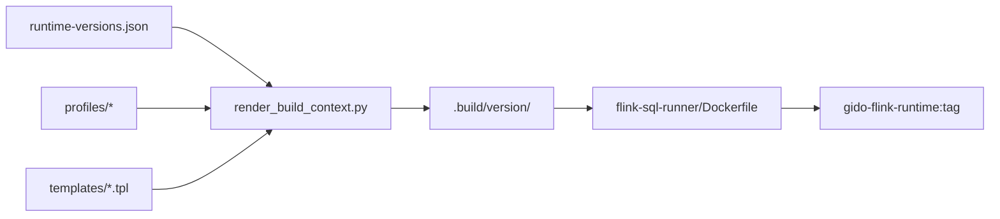

# GIDO Flink Runtime 镜像构建架构

GIDO 将 **Flink 版本、connector 坐标、Hadoop 白名单、校验规则** 收敛到单一配置，再按版本渲染 Maven POM 与 Docker 构建上下文，避免在 `pom.xml` / Dockerfile 中硬编码 2.2.1。

## 目录结构

```
k8s/
├── flink-runtime/                    # 版本与 profile（单一真相源）
│   ├── runtime-versions.json         # 各 Flink 版本的 Maven 坐标、基座镜像、verify 规则
│   ├── profiles/
│   │   ├── 2.2.1/
│   │   │   ├── hadoop-libs.txt       # Paimon S3 catalog Hadoop 白名单
│   │   │   └── security-overrides.txt
│   │   └── 1.17.2/
│   │       ├── hadoop-libs.txt
│   │       └── security-overrides.txt
│   ├── templates/
│   │   ├── connectors-pom.xml.tpl    # Paimon + CDC + S3 依赖
│   │   └── sql-runner-pom.xml.tpl    # sql-runner 编译 POM
│   ├── scripts/
│   │   ├── render_build_context.py   # 渲染 .build/<version>/
│   │   └── verify-image.sh           # 按 verify-manifest 校验镜像
│   ├── connectors.manifest           # 人类可读清单（默认版本说明）
│   └── ARCHITECTURE.md               # 本文件
│
└── flink-sql-runner/                 # 固定构建上下文（源码 + Dockerfile）
    ├── Dockerfile                    # 三阶段：connectors → builder → runtime
    ├── src/                          # com.gido.flink.SqlRunner / RuntimeSmoke
    ├── dedupe-lib-jars.sh
    ├── settings.xml / settings.aliyun.xml
    └── .build/<runtime_key>/         # render 生成（gitignore）
        ├── connectors-pom.xml
        ├── sql-runner-pom.xml
        ├── hadoop-libs.txt
        ├── security-overrides.txt
        ├── verify-connectors.sh
        ├── verify-layout.sh
        └── verify-manifest.json
```

## 构建流水线



### Dockerfile 三阶段

| 阶段 | 输入 | 产出 |
|------|------|------|
| `connectors` | `.build/<ver>/connectors-pom.xml` + hadoop/security 清单 | `target/connectors/*.jar` |
| `builder` | `.build/<ver>/sql-runner-pom.xml` + `src/` | `flink-sql-runner-1.0.0.jar` |
| `runtime` | `FLINK_BASE_IMAGE` + 上述 jar | `/opt/flink/lib`、`usrlib/sql-runner.jar`、`plugins/s3-fs-hadoop/` |

构建参数：

| ARG | 说明 |
|-----|------|
| `RUNTIME_PROFILE` | `runtime-versions.json` 中的 key，如 `2.2.1` |
| `FLINK_BASE_IMAGE` | 如 `apache/flink:2.2.1-java11` |
| `SQL_RUNNER_ARTIFACT_VERSION` | 默认 `1.0.0` |

## 统一版本配置

`runtime-versions.json` 字段说明：

| 字段 | 含义 |
|------|------|
| `default` | CI / 本地默认构建的 runtime key |
| `versions.<key>.flink_version` | Apache Flink 版本 |
| `versions.<key>.base_image` | Docker 基座 |
| `versions.<key>.operator_flink_version` | Operator CRD `flinkVersion`（如 `v2_2`） |
| `versions.<key>.paimon` | Paimon connector Maven 坐标 |
| `versions.<key>.flink_cdc_version` | CDC 行版本（如 `3.6.0-2.2`） |
| `versions.<key>.verify` | 镜像内 jar 存在性 / 禁止项 |

新增 Flink 版本步骤：

1. 在 `runtime-versions.json` 增加 `versions.<新版本>` 条目
2. 添加 `profiles/<新版本>/hadoop-libs.txt`（及可选 `security-overrides.txt`）
3. `python3 k8s/flink-runtime/scripts/render_build_context.py <新版本>` 本地验证
4. `GIDO_FLINK_RUNTIME_VERSION=<新版本> bash k8s/build-flink-runtime.sh` 构建并 `verify-image.sh`

## 常用命令

```bash
# 列出已配置版本
python3 k8s/flink-runtime/scripts/render_build_context.py --list

# 渲染默认版本（2.2.1）
python3 k8s/flink-runtime/scripts/render_build_context.py --default

# 渲染并构建指定版本
GIDO_FLINK_RUNTIME_VERSION=1.17.2 bash k8s/build-flink-runtime.sh

# 校验镜像
bash k8s/flink-runtime/scripts/verify-image.sh gido-flink-runtime:orbstack 2.2.1
```

## CI 集成

`.github/workflows/ci.yml` / `ci-dev-1.yml`：

1. `prepare-flink-matrix` 从 `runtime-versions.json` 的 **`ci_matrix`** 读取并行构建版本（当前 `["2.2.1", "1.17.2"]`）
2. `flink-runtime` job 按 matrix 并行 render、build、verify
3. **默认版本**（`default`）额外打 `latest` / `dev` / `dev-1` 等浮动 tag；非默认版本仅打 Flink 版本号 tag（如 `1.17.2`）

镜像 tag 示例：

| 版本 | GHCR tag（dev 分支） |
|------|---------------------|
| 2.2.1（default） | `dev`、`2.2.1` |
| 1.17.2 | `1.17.2` |

Operator Profile 中 `flink_operator_image` 使用对应版本 tag。

## 与平台运行时消费的关系

| 层 | 位置 | 职责 |
|----|------|------|
| 镜像构建 | `k8s/flink-runtime` + `k8s/flink-sql-runner` | 产出含 connector 的 JM/TM 镜像 |
| 运行时解析 | `gido/backend/app/services/operator_runtime.py` | Profile → 镜像 / namespace |
| 版本推断 | `gido/backend/app/services/flink_version.py` | 镜像 tag → `flinkVersion` CRD |
| 作业提交 | `gido/backend/app/services/flink_operator_submit.py` | 写 `FlinkDeployment.spec.image` |

后续可将 `flink_runtime_catalog.py` 的 connector 列表改为读取 `runtime-versions.json`，与构建侧保持同步。

## 迁移说明

- 根目录 `k8s/flink-sql-runner/pom.xml`、`connectors-pom.xml` 保留供 IDE 参考；**构建以 render 产物为准**。
- `k8s/flink-runtime/hadoop-libs.txt` 为文档副本；权威文件在 `profiles/<ver>/`。
- `k8s/flink-sql-runner/verify-image.sh` 为兼容入口，转发至 `flink-runtime/scripts/verify-image.sh`。
