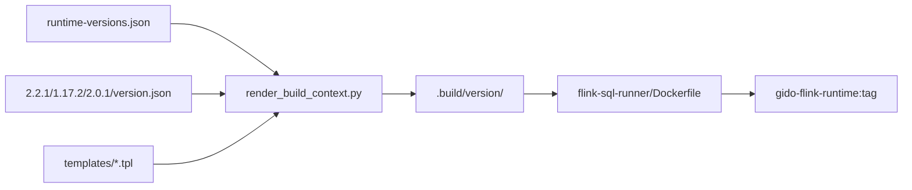

# GIDO Flink Runtime 镜像构建架构

GIDO 将 **Flink 版本、connector 坐标、Hadoop 白名单、校验规则** 按 **Flink 基座镜像版本** 拆分到独立目录，再渲染 Maven POM 与 Docker 构建上下文。

## 目录结构

```
k8s/
├── flink-runtime/
│   ├── runtime-versions.json         # 索引：default、ci_matrix、全局 sql-runner 版本
│   ├── 2.2.1/                        # Flink 2.2.1 运行时（目录名 = flink_version）
│   │   ├── version.json              # 基座镜像、Paimon/CDC 坐标、verify 规则
│   │   ├── hadoop-libs.txt
│   │   ├── security-overrides.txt
│   │   └── connectors.manifest       # 人类可读清单
│   ├── 1.17.2/
│   │   ├── version.json
│   │   ├── hadoop-libs.txt
│   │   └── security-overrides.txt
│   ├── 2.0.1/
│   │   ├── version.json
│   │   ├── hadoop-libs.txt
│   │   └── security-overrides.txt
│   ├── templates/
│   │   ├── connectors-pom.xml.tpl
│   │   └── sql-runner-pom.xml.tpl
│   ├── scripts/
│   │   ├── render_build_context.py
│   │   └── verify-image.sh
│   └── ARCHITECTURE.md
│
└── flink-sql-runner/                 # 共享源码 + Dockerfile
    ├── Dockerfile
    ├── src/
    └── .build/<flink_version>/       # render 生成（gitignore）
```

**约定：** 目录名必须与 `version.json` 中的 `flink_version` 及 `base_image` tag 一致（如 `2.2.1` → `apache/flink:2.2.1-java11`）。

## 构建流水线



### Dockerfile 三阶段

| 阶段 | 输入 | 产出 |
|------|------|------|
| `connectors` | `.build/<ver>/connectors-pom.xml` + hadoop/security 清单 | `target/connectors/*.jar` |
| `builder` | `.build/<ver>/sql-runner-pom.xml` + `src/` | `flink-sql-runner-1.0.0.jar` |
| `runtime` | `FLINK_BASE_IMAGE` + 上述 jar | `/opt/flink/lib`、`usrlib/sql-runner.jar`、`plugins/s3-fs-hadoop/` |

构建参数：

| ARG | 说明 |
|-----|------|
| `RUNTIME_PROFILE` | Flink 基座版本目录名，如 `2.2.1` |
| `FLINK_BASE_IMAGE` | 如 `apache/flink:2.2.1-java11` |
| `SQL_RUNNER_ARTIFACT_VERSION` | 默认 `1.0.0`（来自索引） |

## 版本配置

### 索引 `runtime-versions.json`

| 字段 | 含义 |
|------|------|
| `default` | CI / 本地默认构建版本 |
| `ci_matrix` | CI 并行构建列表 |
| `sql_runner_artifact_version` | sql-runner JAR 版本 |

### 各版本 `version.json`

| 字段 | 含义 |
|------|------|
| `flink_version` | 须与目录名一致 |
| `base_image` | Docker 基座 |
| `operator_flink_version` | Operator CRD `flinkVersion` |
| `paimon` | Paimon connector Maven 坐标 |
| `flink_cdc_version` | CDC 行版本 |
| `verify` | 镜像内 jar 存在性 / 禁止项 |

### 当前版本矩阵

| 目录 | Flink | Operator | Paimon | CDC |
|------|-------|----------|--------|-----|
| `2.2.1`（default） | 2.2.1 | `v2_2` | paimon-flink-2.2 @ 1.4.1 | 3.6.0-2.2 |
| `1.17.2` | 1.17.2 | `v1_17` | paimon-flink-1.17 @ 0.9.0 | 3.2.1 |
| `2.0.1` | 2.0.1 | `v2_0` | paimon-flink-2.0 @ 1.3.2 | 3.5.0 |

新增 Flink 版本：

1. 创建 `k8s/flink-runtime/<flink_version>/version.json` + `hadoop-libs.txt` + `security-overrides.txt`
2. 将 `<flink_version>` 加入 `runtime-versions.json` 的 `ci_matrix`
3. `python3 k8s/flink-runtime/scripts/render_build_context.py <flink_version>` 本地验证
4. `GIDO_FLINK_RUNTIME_VERSION=<flink_version> bash k8s/build-flink-runtime.sh`

## 常用命令

```bash
python3 k8s/flink-runtime/scripts/render_build_context.py --list
python3 k8s/flink-runtime/scripts/render_build_context.py --all
GIDO_FLINK_RUNTIME_VERSION=2.0.1 bash k8s/build-flink-runtime.sh
bash k8s/flink-runtime/scripts/verify-image.sh gido-flink-runtime:orbstack 2.2.1
```

## CI 集成

`.github/workflows/ci.yml` / `ci-dev-1.yml`：

1. `prepare-flink-matrix` 从 `ci_matrix` 读取并行构建版本（当前 `["2.2.1", "1.17.2", "2.0.1"]`）
2. `flink-runtime` job 按 matrix render、build、verify
3. **默认版本**额外打浮动 tag；非默认版本打 Flink 版本号 tag（如 `1.17.2`、`2.0.1`）
